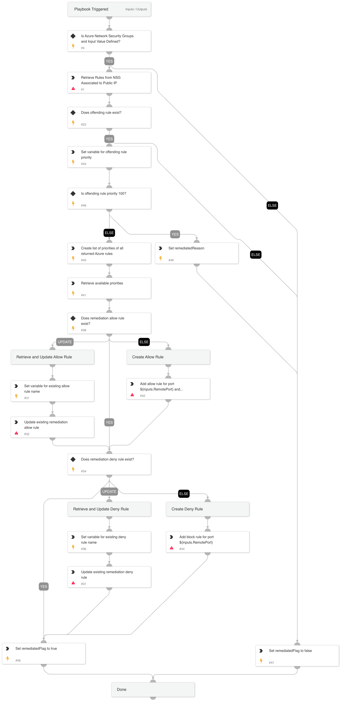

This playbook adds new Azure Network Security Groups (NSG) rules to NSGs attached to a NIC. The new rules will give access only to a private IP address range and block traffic that's exposed to the public internet ([using the private IP of the VM as stated in Azure documentation](https://learn.microsoft.com/en-us/azure/virtual-network/network-security-groups-overview)). For example, if RDP is exposed to the public internet, this playbook adds new firewall rules that only allows traffic from private IP address and blocks the rest of the RDP traffic.

Conditions and limitations:
- Limited to one resource group.
- 200 Azure rules viewed at once to find offending rule.
- 2 priorities lower than the offending rule priority must be available.
- Adds rules to NSGs associated to NICs.

## Dependencies

This playbook uses the following sub-playbooks, integrations, and scripts.

### Sub-playbooks

This playbook does not use any sub-playbooks.

### Integrations

* Azure Network Security Groups

### Scripts

* AzureFindAvailableNSGPriorities
* Set

### Commands

* azure-nsg-security-rules-list
* azure-nsg-security-rule-create
* azure-nsg-security-rule-update

## Playbook Inputs

---

| **Name** | **Description** | **Default Value** | **Required** |
| --- | --- | --- | --- |
| AzureSecurityGroup | The Azure Network Security Group that will have new rules created or updated. |  | Required |
| AzureVMPrivateIP | The private IP of the Azure Virtual Machine. |  | Required |
| RemoteProtocol | The remote protocol that is publicly exposed. |  | Required |
| RemotePort | The remote port that is publicly exposed. |  | Required |
| SubscriptionID | The Azure subscription ID \(optional\). |  | Optional |
| ResourceGroup | The Azure resource group \(optional\). |  | Optional |
| instance_name | Azure Network Security Groups integration instance to use if you have multiple instances configured \(optional\). |  | Optional |
| RemediationAllowRanges | Comma separated list of IPv4 network ranges to be used as source addresses for the \`remediation-allow-port-&lt;port\#&gt;-&lt;tcp\|udp&gt;\` rule to be created.  Typically this will be private IP ranges \(to allow access within the vnet and bastion hosts\) but other networks can be added as needed. | 172.16.0.0/12,10.0.0.0/8,192.168.0.0/16 | Optional |

## Playbook Outputs

---

| **Path** | **Description** | **Type** |
| --- | --- | --- |
| remediatedFlag | Output key to determine if remediation was successfully done. | boolean |
| remediatedReason | Reason remediation was done or not done. | string |

## Playbook Image

---

