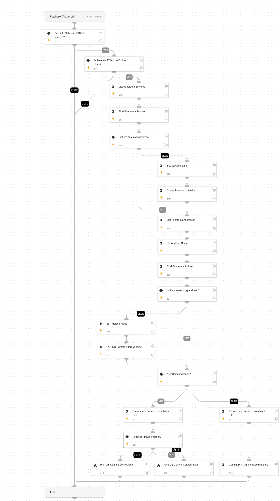

This playbook blocks a destination IP and service (TCP or UDP port) by creating a rule for a specific device group on PAN-OS. 

## Dependencies

This playbook uses the following sub-playbooks, integrations, and scripts.

### Sub-playbooks

* PAN-OS Commit Configuration

### Integrations

* Panorama

### Scripts

* Set
* SetAndHandleEmpty

### Commands

* pan-os-create-service
* pan-os-list-addresses
* pan-os-create-address
* pan-os-list-services
* pan-os-create-rule

## Playbook Inputs

---

| **Name** | **Description** | **Default Value** | **Required** |
| --- | --- | --- | --- |
| LogForwarding | Panorama log forwarding object name. |  | Optional |
| IP | IP address to block. |  | Optional |
| AutoCommit | This input establishes whether to commit the configuration automatically. True - Commit automatically. False - Commit manually. | False | Optional |
| DeviceGroup | Target Device Group. |  | Optional |
| Port | Destination port to block. |  | Optional |
| Protocol | Protocol |  | Optional |
| ServiceNamePrefix | Prefix of the Service name to be created. | xsoar-service- | Optional |
| RuleNamePrefix | Prefix of the Rule name to be created. | xsoar-rule- | Optional |
| ObjectNamePrefix | Prefix of the object name to be created. | xsoar-object- | Optional |
| WhereRule | Where to move the rule. If you specify "before" or "after", you need to supply the "dst" argument. \(Default is: 'top'\) | top | Optional |
| SourceZone | A comma-separated list of source zones. |  | Optional |
| DestinationZone | A comma-separated list of destination zones. |  | Optional |
| SecondaryDeviceGroup | In that case that the rule, address and service are created in the "Shared" location, we need to know what device-groups we can push to because it isn't possible to push to the "Shared" location. |  | Optional |

## Playbook Outputs

---
There are no outputs for this playbook.

## Playbook Image

---

